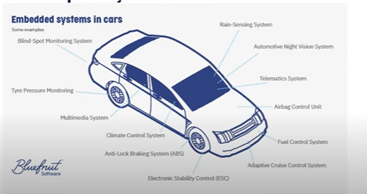

 
  <h1>EmbarcaTech</h1> 
  Repositório de estudos para o curso EAD - EmbarcaTech (Residência Tecnloógica em Sistemas Embarcados)

## Unidade 1 - Introdução a educação a distância
### 1. Tecnologia e sua Relação com a humanidade
A unidade 1 explora a origem da tecnologia como um todo. Desde a seleção das ferramentas naturais até a própria fabricação. O termo tecnologia surgiu na Idade Média, como um derivado das habilidades práticas, chamado **ars mechanica.**

Partindo para a atualidade, o dicionário de Houaiss define como "teoria geral e/ou estudo sistemático sobre técnicas, processos, métodos meios e instrumentos de um ou mais ofícios ou domínios da atividade humana". Resumidamente: Mostra como a tecnologia não se trata apenas de uma ferramenta, mas principalmente os processos e sistemas.

A tecnologia se divide em 3 classificações:
1. Tecnologias Materiais(Duras): Engenharias, medicina, criação e manuseio de instrumentos e máquinas;
2. Tecnologias Sociais(Flexíveis): Psicologia, sociologia, etc;
3. Tecnologias Conceituais: Informática, teorias de sistema, metodologias;

### 2. Tecnologias da Informação e Comunicação (TICs) no cotidiano

### Atividades práticas da Unidade
1) Escreva sua própria definição de tecnologia e compare-a com as definições
apresentadas neste capítulo. RS: A tecnologia nada mais é do que o estudo conceitual e sistemático do uso das ferramentas as quais surgem e acompanham a evolução da humanidade, de tal forma que agregue significamente em seu meio.

2) Faça uma lista de tecnologias que você utiliza diariamente e reflita sobre como elas moldam sua rotina e interação com o meio ambiente. RS: Tecnologias como Smartphones, que abriram fronteiras para o surgimento das redes sociais, influenciou totalmente o meio ambiente dos cidadãos, desde o surgimento da dependência de tela como um problemática que cresce exponencialmente.
 
3) WhatsApp, Spotify, Google Classroom, Github e VSCode. Todas as 5 TICs agregam diretamente em meu desempenho pessoal como profissional, seja mantendo o foco com músicas, seja com as plataformas de apoio e material de ensino.

4) Github como uma TIC positiva, atua muito bem tanto para a prática profissional ou como uma comunidade ativa na área de desenvolvimento. Por fim, para uma TIC negativa, menciono o Instagram, que como uma rede social, traz consigo grandes problemas como a autocomparação entre os usuários, ou a dependência de uso.

## Unidade 2 - Sistemas Embarcados
### 1. O que é um Sistema Embarcado?
Um sistema embarcado é um sistema de computação projetado para uma função específica.

### 2. Classificação:

- Sistemas embarcados autônomos:
- Sistemas embarcados não determinísticos:
- Sistemas embarcados orientados ao desempenho:
- Sistemas embarcados críticos para segurança: 
- Sistemas embarcados táticos
- Sistemas embacados centralizados
- Sistemas embarcados em rede
- Sistemas embarcados em tempo real
- Sistemas embarcados co eficiência enpergetica
- Sistemas embarcados portáteis
- Sistemas emvarcados distribuidos

### 3. Tipos de Aplicações:

- Propósito geral:
- Sistemas de controle:
- Processamento de sinais:
- Comunicações e Redes

\
Um exemplo, é quando o carro dá ré, e apita supondo a proximidade de algum objeto em hipótese de colidir.

### 4. Classificação dos Sistemas em Tempo Real
- Soft Real Time:
As tarefas são executadas em tempo específico, sem prejuízo de funcionamento grave se este tempo não for cumprido.

- Hard Real Time:
As tarefas são executadas em tempo específico para cada uma e no caso da falha de alguma tarefa, há consequências graves para o sistema.

### 5. Características dos Sistemas Embarcados
- Características específicas, por exemplo: alguns não podem parar;
- Ser o menor possível;
- Uso de microcontroladores devido o consumo restrito de mémoria, tamanho, e velocidade de processamento;
- Executa somente um programa, repetidamente;
- Sistemas Reativo de Tempo Real;
- Presença de sensores e/ou atuadores que possibilitam reagir ao ambiente.
- O Firmware do sistema embarcado não pode ser usado em outros sistemas sem que não sejam feitas mudanças.
- Hardware sob medida para que o sistema funcione perfeitamente em sua aplicação
- Interdependente do Firmware e do Hardware

### 6. Restrições
- Baixo custo;
- Interface simples;
- Dimensão reduzida;
- Segurança;
- Disponibilidade;
- Estabilidade;
- Robustez;
- Baixa potência;
- Tempo de resposta;

### 7. Restrições de Rede
- Bluetooth;
- Bluetooth Audio;
- Bluetooth Sensor;
- Bluetooth SmartTv (?);

- Baixa taxa de bits
- Alta perda de pacotes
- Prejuízo para o uso de pacotes maiores

## 3. Arquitetura de Sistemas Embarcados

Existe um Software e um Hardware em um Sistema Embarcado

Software terá:
- Firmware
- Sistema Embarcado
- Debug
- Drivers

Hardware terá:
- CPU
- Memória
- Interfaces
- Circuitos Auxiliares

### 1. Componentes de um Sistema Embarcado
- Microcontrolador\
O microcontrolador incorpora funções em um unico chip, e pode converter analógicos digitais (ADC) e digitais analógicos (DAC), memória de instruções ou dados, geradores de clock, etc.
- Memória Externa
- Periféricos e Interfaces\
Os **Periféricos** são componentes de um SE, que podem dar entrada e saída, acessando o microcontrolador.\
Já as **Interfaces** são quem fazem a ligação entre os periféricos e as MCU's, exemplos: Interface pra teclado, interface LCD, etc.
- Sensores

- Atuadores\
Drivers de motores, Drivers de Led, Emissores, etc.

#### 2. Arquitetura do Hardware
Pesquisar sobre:

Arquitetura de Harvard != Arquitetura de Von Neumann

### 3. Aplicação dos SEs
- Indústria
- Segurança
- Agronegócio
- Health Care
- Logística