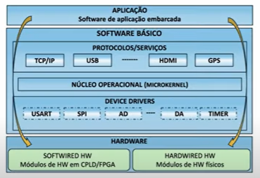

 
  <h1>EmbarcaTech</h1> 
  Repositório de estudos para o curso EAD - EmbarcaTech (Residência Tecnloógica em Sistemas Embarcados)

# Unidade 2 - Sistemas Embarcados
## 1. O que é um Sistema Embarcado?
Um sistema embarcado é um sistema de computação projetado para uma função específica.

### 1. Classificação:

- Sistemas embarcados autônomos:
- Sistemas embarcados não determinísticos:
- Sistemas embarcados orientados ao desempenho:
- Sistemas embarcados críticos para segurança: 
- Sistemas embarcados táticos
- Sistemas embacados centralizados
- Sistemas embarcados em rede
- Sistemas embarcados em tempo real
- Sistemas embarcados co eficiência enpergetica
- Sistemas embarcados portáteis
- Sistemas emvarcados distribuidos

### 2. Tipos de Aplicações:

- Propósito geral:
- Sistemas de controle:
- Processamento de sinais:
- Comunicações e Redes

Um exemplo, é quando o carro dá ré, e apita supondo a proximidade de algum objeto em hipótese de colidir.

### 3. Classificação dos Sistemas em Tempo Real
- Soft Real Time:
As tarefas são executadas em tempo específico, sem prejuízo de funcionamento grave se este tempo não for cumprido.

- Hard Real Time:
As tarefas são executadas em tempo específico para cada uma e no caso da falha de alguma tarefa, há consequências graves para o sistema.

### 4. Características dos Sistemas Embarcados
- Características específicas, por exemplo: alguns não podem parar;
- Ser o menor possível;
- Uso de microcontroladores devido o consumo restrito de mémoria, tamanho, e velocidade de processamento;
- Executa somente um programa, repetidamente;
- Sistemas Reativo de Tempo Real;
- Presença de sensores e/ou atuadores que possibilitam reagir ao ambiente.
- O Firmware do sistema embarcado não pode ser usado em outros sistemas sem que não sejam feitas mudanças.
- Hardware sob medida para que o sistema funcione perfeitamente em sua aplicação
- Interdependente do Firmware e do Hardware

### 5. Restrições
- Baixo custo;
- Interface simples;
- Dimensão reduzida;
- Segurança;
- Disponibilidade;
- Estabilidade;
- Robustez;
- Baixa potência;
- Tempo de resposta;

### 6. Restrições de Rede
- Bluetooth;
- Bluetooth Audio;
- Bluetooth Sensor;
- Bluetooth SmartTv (?);

- Baixa taxa de bits
- Alta perda de pacotes
- Prejuízo para o uso de pacotes maiores

## 2. Arquitetura de Sistemas Embarcados

Existe um Software e um Hardware em um Sistema Embarcado

**Software terá:**
1. Firmware - É um software (programa, script), gravado no microcontrolador que determina o que seu SE irá fazer.
2. Sistema Embarcado
3. Debug
4. Drivers

**Hardware terá:**
1. CPU
2. Memória
3. Interfaces
4. Circuitos Auxiliares

### 1. Componentes de um Sistema Embarcado
**Microcontrolador**\
O microcontrolador incorpora funções em um unico chip, memória de instruções ou dados, geradores de clock, etc.

***Memória Externa(Estudando)***

**Periféricos e Interfaces**\
Os **Periféricos** são componentes de um SE, que podem dar entrada e saída, acessando o microcontrolador.\
Já as **Interfaces** são quem fazem a ligação entre os periféricos e as MCU's, exemplos: Interface pra teclado, interface LCD, etc.

***Sensores(Estudando)***

***Atuadores(Estudando)***\
Drivers de motores, Drivers de Led, Emissores, etc.

### *Diferença entre Microcontrolador e Microprocessador?*
**Microprocessador:**\
O microprocessador trabalha no processamento de tarefas, tempo de execução e agilidade onde será implementado no Sistema Embarcado em que execute tarefas diversificadas.

**Microcontrolador:**\
Já o microcontrolador, trabalha de forma mais generalizada. É o chip que se responsabiliza em tarefas específicas, de preferência para o baixo consumo de energia com ênfase nessa tarefa em específico.

Usa-se um ou outro dependendo das necessidades do Sistema Embarcado.

### 2. Arquitetura do Hardware
Algumas das principais arquiteturas são:

**Arquitetura Harvard Risc:**\
Sua principal característica é a unidade de processamento cujo possui **um número restrito de tarefas, o que resulta em uma execução de tarefas mais rápida.** Seu microcontrolador é o RISC que possui um acesso de memória mais ágil.

**Arquitetura Von Neumann:**\
Já nessa arquitetura, sua principal característica é **a maior gama de tarefas que é capaz de executar**, como consequência, a eficiência de execução cai. Seu microcontrolador é o CISC, que possui um **acesso a memória lenta**, compacta, e que realiza esse acesso um de cada vez.

### 3. Arquitetura em Camadas
\
Esse modelo é composto de 3 camadas:
1. Camada de Hardware: Nessa camada, é incluído todos os componentes físicos do microcontrolador.

    **Qual a diferença de Flash, SRAM e DRAM?**
A SRAM (Memória Estática), é a memória que acessa dados temporários de forma rápida. Mas cara.\
A DRAM (Memória Dinâmica), é a memória que consegue armazenar mais dados. Mais lenta, e mais usada.\
Já a memória Flash, é usada para armazenamento permanente, que armazena até desligado.

3. Camada de Software básico: Aqui, temos o firmware, drivers, e dependendo, um sistema operacional.
4. Camada de aplicação: Já nessa, é a camada responsabilizada com a função que o SE irá executar.
