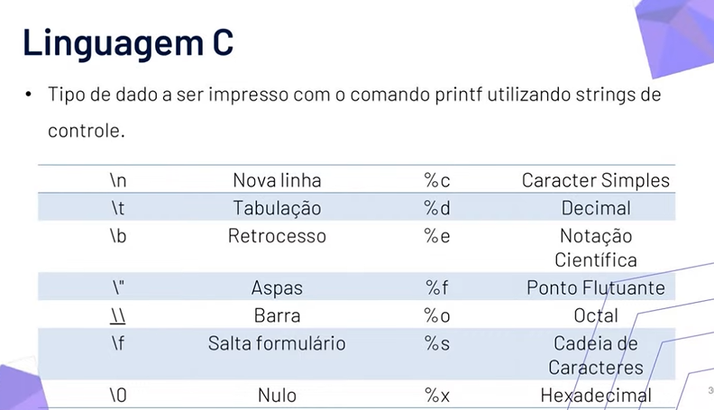

 
  <h1>EmbarcaTech</h1> 
  Repositório de estudos para o curso EAD - EmbarcaTech (Residência Tecnloógica em Sistemas Embarcados)

# Unidade 3 - Linguagens e ambientes de programação
## 1. Introdução a Linguagem C

Inicialmente, a aula síncrona se tratou mais de uma introdução a linguagem e ao cadastro no GitHub.

**Por que C?**\
A linguagem de programação C é a maior linguagem em relação a eficiência de código. Como um sistema embarcado é focado em realizar funções específicas, é crucial que o código seja pequeno e eficiente.

**Observações:**\
Algumas funções não funcionam no microcontrolador, como printf, então será usado outras funções.